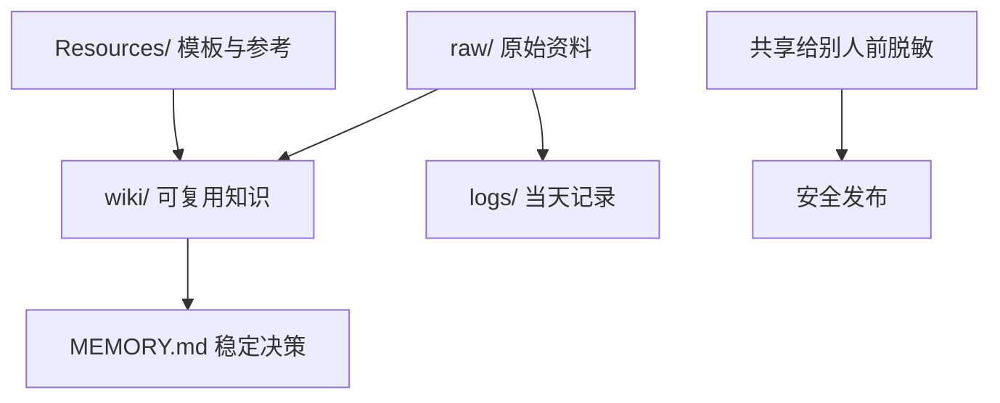

# Shared Vault Workflow

一个可以跨设备、跨 Agent、跨同事复用的 Obsidian 工作流。

它的目标很简单：

- 让 Codex、Claude、OpenClaw、以及你未来换掉的任何本地 agent，都能读同一套规则
- 让 `raw / wiki / MEMORY / logs / Resources` 分工清楚，不再混在一起
- 让你可以安全地把方法转发给别人，而不是把自己的私密环境一起打包出去

## 一句话概括

把一个 Vault 变成“共享大脑”，把秘密留在本机，把方法带着走。

## 你会得到什么

- 一个清晰的共享资料库结构
- 一套可直接给 AI agent 读取的启动说明
- 一套适合人类阅读的中文上手文档
- 一套对外分享前的脱敏清单
- 一份日志安全规范
- 一份 Resources 目录的发布清单
- 一个可快速扫出明显密钥痕迹的检查脚本

## 这个项目适合谁

- 想把多台 Mac 的工作流统一起来的人
- 想让不同 AI agent 接手同一套资料的人
- 想把个人知识库整理成团队可复用模板的人
- 想公开分享方法，但不想泄漏私人资料的人

## 核心原则



- `raw/` 放原始输入，比如文章、截图、转录稿
- `wiki/` 放整理后的知识和结论
- `MEMORY.md` 放长期稳定、会影响后续判断的内容
- `logs/` 放当天发生了什么和交接信息
- `Resources/` 放模板、参考和可复用材料

## 为什么它可靠

因为它把“资料”和“秘密”分开了。

共享出去的是：

- 结构
- 规则
- 命名方式
- 分类方法
- 脱敏后的示例

留在本机的是：

- API key
- token
- cookie
- 密码
- 恢复码
- 本机专属配置
- 私有路径
- 私密工作记录

## 快速开始

如果你是人，先看：

1. [START_HERE.md](START_HERE.md)
2. [references/onboarding-zh.md](references/onboarding-zh.md)
3. [references/redaction.md](references/redaction.md)
4. [references/logs-safety.md](references/logs-safety.md)
5. [references/resources-checklist.md](references/resources-checklist.md)

如果你是 AI agent，先看：

1. [AGENT_PROMPT_zh.md](AGENT_PROMPT_zh.md)
2. [SKILL.md](SKILL.md)
3. [references/folder-map.md](references/folder-map.md)
4. [references/maintenance.md](references/maintenance.md)

发布前先跑：

```bash
bash scripts/check-secrets.sh /path/to/repo
```

## 推荐工作方式

1. 先分类，再写入
2. 原始内容先放 `raw/`
3. 整理后的知识放 `wiki/`
4. 稳定结论追加到 `MEMORY.md`
5. 当天过程写进 `logs/`
6. 对外分享前先脱敏

## 目录说明

- `SKILL.md`：支持 skills 的 agent 直接读取
- `AGENT_PROMPT_zh.md`：不支持 skills 时的启动提示
- `START_HERE.md`：给人看的最短版入口
- `QUICKSTART.md`：更短的快速索引
- `references/folder-map.md`：目录标准
- `references/maintenance.md`：写入顺序和维护规则
- `references/redaction.md`：脱敏清单
- `references/logs-safety.md`：日志安全规则
- `references/resources-checklist.md`：Resources 发布清单
- `references/export-package-zh.md`：对外转发包结构
- `scripts/check-secrets.sh`：发布前检查脚本

## 分享给别人的方式

最推荐的做法是只发这个仓库，再附上：

- [START_HERE.md](START_HERE.md)
- [AGENT_PROMPT_zh.md](AGENT_PROMPT_zh.md)

这样对方既能看懂人类版说明，也能直接让本地 agent 上手。

## 适合放进团队流程的原因

- 新人上手成本低
- 多设备切换成本低
- 不同 agent 之间的规则一致
- 秘密和方法分层清晰
- 以后可以继续扩展成团队标准

## 安全底线

只发布“方法”，不发布“你的私人环境”。

不要发：

- 真实姓名
- 邮箱
- 机器名
- 私有绝对路径
- 任何密钥或登录码
- 私有会话记录
- 真实业务秘密

如果你不确定，就先不要发。

## 项目定位

这不是一个“笔记模板仓库”。

它是一个让多个 AI agent 在多个设备上使用同一套知识规则的工作流骨架。
